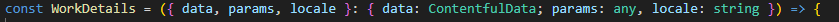

# Stack

🔄 **Next.js** - ***Con Pages Router y Exportación Estática***
🎨 **Tailwind** - *Framework CSS orientado a utilidades*
📝 **TypeScript** - *JavaScript con tipado seguro*
⚡ **ESLint** - *Herramienta de calidad de código*
🐶 **Husky** - *Automatización de hooks de Git*
📦 **Contentful** - *CMS sin interfaz*

# Tabla de Contenido
- [Puesta en marcha](#puesta-en-marcha)
- [Personalización](#personalización)
    - [Textos](#textos)
    - [Colores](#colores)
- [Formulario de mail](#formulario-de-mail)
    - [Configuración](#configuración)
    - [Eliminar esta funcionalidad](#eliminar-esta-funcionalidad)
- [Dudas comunes](#dudas-comunes)
    - [¿Cómo accedo al lenguaje de manera local?](#cómo-accedo-al-lenguaje-de-manera-local)


# Puesta en marcha
1. Crear los tipos correspondientes en Contentful
    - Acordarse de cambiar los locales a "es" y "en"
2. Si es la primera vez que se usa la plantilla en este PC, instalar contentful-cli globalmente
 ```
npm i -g contentful-cli
```
3. Instalar los paquetes:
```
npm i
```
4. Crear archivo .env.local
```
SPACE_ID="*****"
ACCESS_TOKEN="*****"
RESEND_API_KEY="*****"
```
5. Generar los tipos
```
npm run codegen
```
6. Ajustar ```NavBarProps``` en ```components/NavBar.tsx``` y ```getNavbarProps()``` en ```utils/loader/staticLoaders.ts```
7. Seguir el ejemplo de getStaticProps() del index en cada página
8. Usar getStaticPaths() cuando sea necesario

# Personalización
## Textos
1. Escoger las fuentes en _app.tsx
- Para fuentes de Google:
 ```
import {fuente} from "next/font/google";
 
const variable = fuente(opciones);
 ```

- Para fuentes locales:
 ```
import localFont from "next/font/local";
 
const variable = localFont(opciones);
 ```

2. Añadir la variable de la fuente y los tamaños responsive al final  del global.scss (usar https://www.fluid-type-scale.com/)
3. Editar la escala de tamaños en la propiedad ```theme.fontSizes``` del tailwind.config.ts

## Colores
En **tailwind.config.ts**, añadir colores a ```colorPalette``` y sus funciones en ``` theme.colors``` .

## Formulario de mail
Habría que modificar el destinatario en api/send.ts y modificar el componente EmailTemplate y ContactForm al gusto

## Favicon
Ir a https://realfavicongenerator.net/ y copiar las siguientes imagenes en ```/public```
- ```favicon.ico```
- ```/web-app-manifest-192x192.png```
- ```/web-app-manifest-192x192.png```

Modificar el título de la web en ```manifest.json```

# Quitar funcionalidades
## Mail
- Borrar carpeta ```api```
- Borrar ```resend``` de ```package.json```
- Borrar los componentes ```EmailTemplate``` y ```ContactForm```
## Multilenguaje
- Modificar la constante ```languages``` en ```_app.tsx```
- Comentar la propiedad ```i18n``` en ```next.config.ts```

# Dudas comunes
## ¿Cómo accedo al lenguaje de manera local?
Usando la propiedad propiedad ```locale``` que se le pasa por defecto a todas las páginas:

